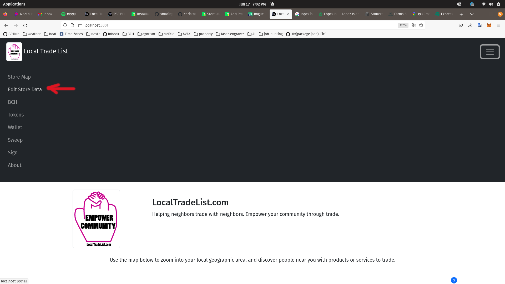
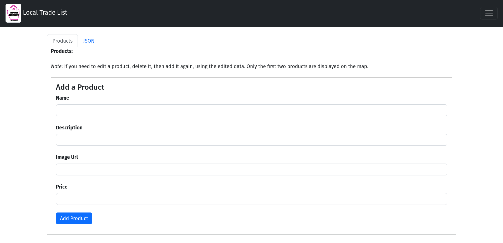

# Add Products

## Edit Store Data

Once your store has been created, the app will reload and the *Create Store* menu item will change to *Edit Store Data*.

## Add a Product

The form for creating a new product listing is very similar to the one for creating a store. All the fields are optional, simply fill in what you want. Click the *Add Product* button to add the product to your store listing.

Only two products are displayed on the map for a store. But the profile page for a store will display all products.

## Edit a Product

Instead of editing a product, delete it and recreate it. Because of the nature of the blockchain technology, it's not possible to edit a product. But they can be deleted and replaced, which serves the same function as editing.
