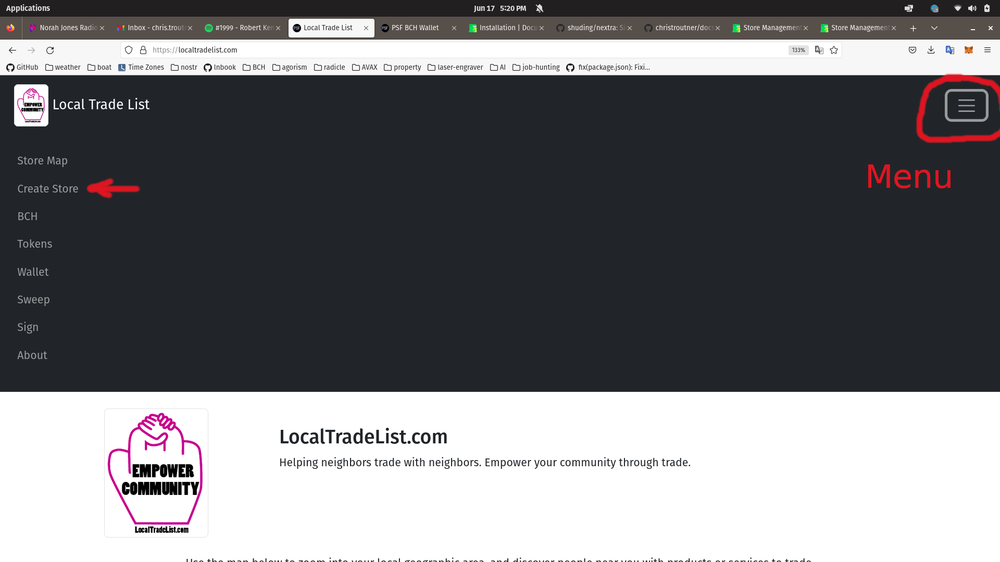
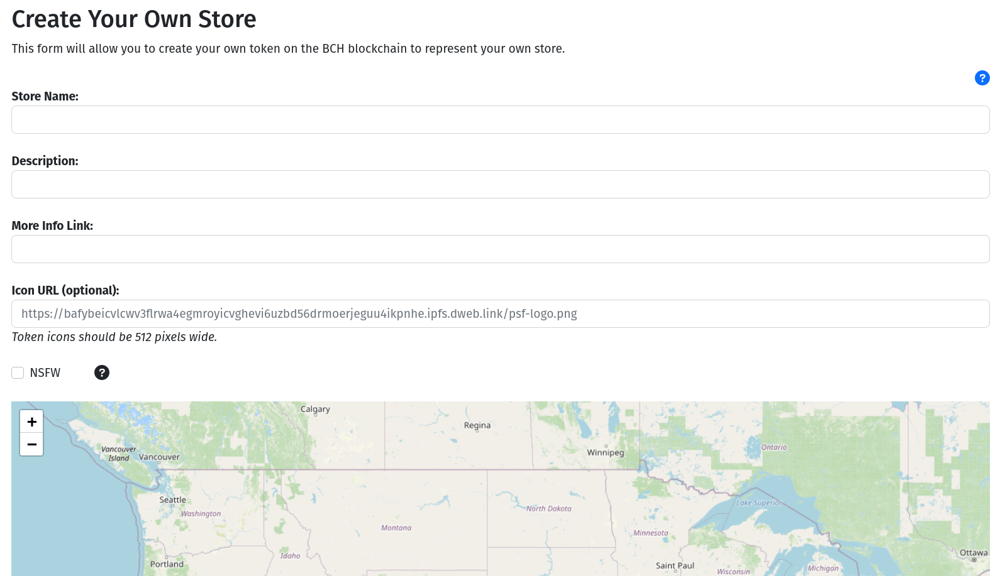
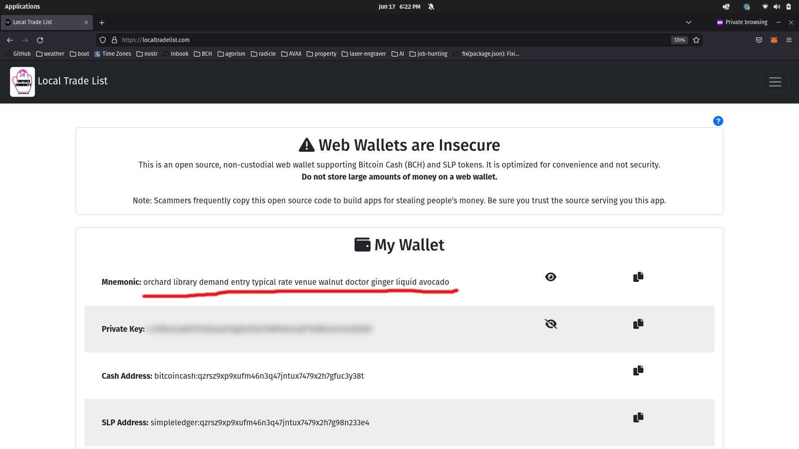

# Create a Store

On [LocalTradeList.com](https://localtradelist.com), create a store by clicking on the menu button in the top, right corner, and selecting the *Create Store* item from the menu.

## Store Form

To create a store, simply fill out the four text boxes. Then click on the map where you want your store to be shown.

Rather than uploading an image directly, the icon image for your store should be a URL. [Imgur](https://imgur.com/) and [NFT.storage](https://nft.storage) are free image hosting services that you can use to host your image and generate a URL. Try to keep the image to 512 pixels or smaller, so the image loads quickly for users.

If you are selling items from your home, we recommend you **do not** place the pin at your home location. Place it instead at a local community center, post office, or library. Users of the map expect to be in your neighborhood, but there is no need to disclose your location to everyone.

If you have your own website, be sure to paste the URL into the *More Info Link* text box. The app is intended primarily to be a directory of local businesses. However, the app allows advertisement of up to two products after the store is created, so you are not required to have your own website.

After you fill out the four boxes, click on the map to place a pin, then click the blue *Create Store* button to create your store.

## BCH Wallet

To create a store, you will need a few cents of Bitcoin Cash (BCH), a cryptocurrency. This is used to pay for fees. For a limited time, LocalTradeList.com is providing a faucet. When you create your store, the wallet will automatically be funded with BCH.

Your new store is actually a cryptographic token, controlled by twelve (12) words. You should back up your wallet by writing these twelve words onto a piece of paper and keeping it in a safe place. This backup will allow you to update your store from another computer.

To backup the wallet, navigate to the *Wallet* item in the Menu. Click on the eye-icon to reveal the 12 words. [Here is a video explaining these ideas in more detail](https://youtu.be/0R00cppN0fA).

