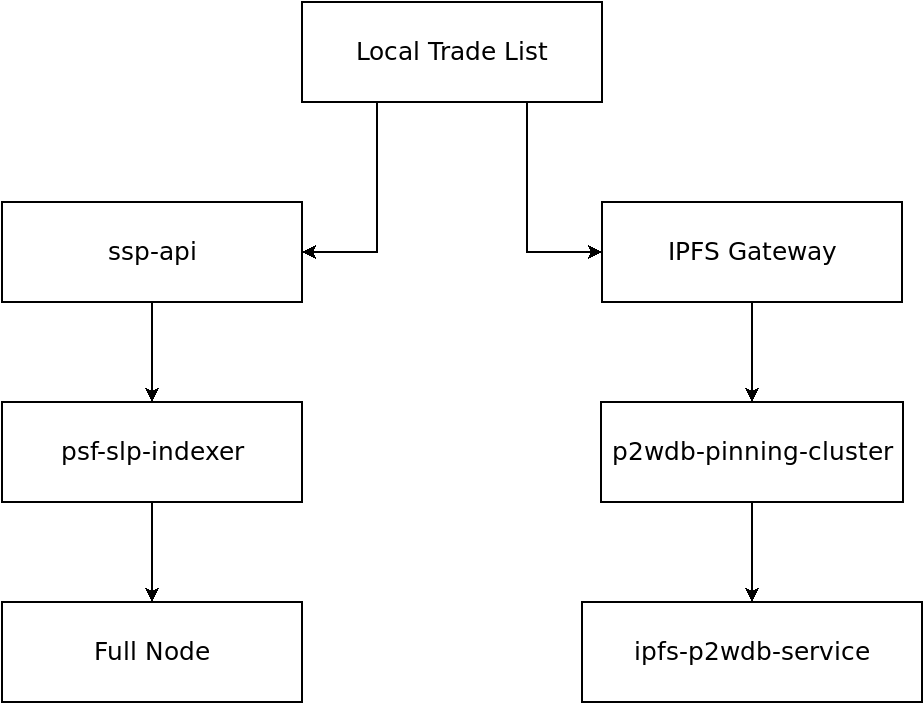

# Architecture

This page describes how the different pieces of technology fit together to make Local Trade List work. Below is a diagram showing the pieces of software that make Local Trade List function. On the left is the blockchain infrastructure. On the right is the IPFS infrastructure.

At the bottom of this page is a summary of the political ramifications of this technology.

Here are links to the software in the diagram:

- [localtradelist.com](https://github.com/christroutner/localtradelist.com) - The (front end) web browser-based user interface.
- [ssp-api](https://github.com/Permissionless-Software-Foundation/ssp-api) - REST API that tracks stores and store metadata.
- [psf-slp-indexer](https://github.com/Permissionless-Software-Foundation/psf-slp-indexer) - A token indexer keeping track of tokens representing stores.
- [BCHN full node](https://github.com/Permissionless-Software-Foundation/docker-bchn) - The primary software for working with the blockchain.
- [p2wdb-pinning-cluster](https://github.com/Permissionless-Software-Foundation/p2wdb-pinning-service) - An IPFS pinning service that saves store and product data.
- [ipfs-p2wdb-service](https://github.com/Permissionless-Software-Foundation/ipfs-p2wdb-service) - The [pay-to-write database (P2WDB)](https://p2wdb.com).

## Blockchain

The Local Trade List (front end) web-browser-based user interface communicates directly with [ssp-api](https://github.com/Permissionless-Software-Foundation/ssp-api), a REST API back end. This back end software contains a local database and holds all the raw data that gets displayed in the web browser.

ssp-api is fed data from the [psf-slp-indexer](https://github.com/Permissionless-Software-Foundation/psf-slp-indexer). psf-slp-indexer is similar to a search engine bot. Instead of crawling webpages, the bot crawls and constantly monitors the blockchain for [SLP token](https://github.com/simpleledger/slp-specifications/blob/master/slp-token-type-1.md) transactions. A *Store* in Local Trade List is represented as a [SLP Group token](https://github.com/simpleledger/slp-specifications/blob/master/slp-nft-1.md) on the blockchain. SLP (Simple Ledger Protocol) is a flexible token protocol that can run on most blockchains. This improves the censorship resistance of Local Trade List. If there is ever an issue with one blockchain, all the software that powers Local Trade List can be moved to a new blockchain.

psf-slp-indexer communicates directly with a *Full Node*. A Full Node is the primary piece of software that runs a blockchain. It independently validates new transactions, keeps a local copy of the blockchain data, and it is able to broadcast transactions to the blockchain network.

## IPFS

[IPFS](https://ipfs.io), the interplanetary file system, is used to save and transmit data. Blockchains are optimized for censorship resistance, and not for saving large amounts of data. IPFS compliments blockchains. A *Store* in Local Trade List is anchored into the blockchain as a cryptographic token. That token points to the raw data, which is saved on IPFS and provided by an *IPFS Gateway*.

The [Pay-to-Write Database (P2WDB)](https://p2wdb.com) is a censorship-resistant database that combines the features of a blockchain, but is optimized for saving data. The [p2wdb-pinning-cluster](https://github.com/Permissionless-Software-Foundation/p2wdb-pinning-service) is an optional plugin for the P2WDB that will *pin* IPFS content (like Store data and images). *Pinning* is the service of saving and providing data over the IPFS network.

## Group Moderation

Beyond the infrastructure used to build an instance of Local Trade List, the concept is also an exercise in *group moderation*. This is an exciting new paridigm in governance.

Data on a Bitcoin-based blockchain can never be deleted. New blocks can only be added to the blockchain so long as the data in old blocks has not been tampered with. This was the fundamental new invention behind blockchains and what made them different from all technology that came before them.

Data on IPFS will always be available so long as there is one computer on the internet willing to provide it. And it uses many of the same cryptographic techniques used by blockchains. As a result, files on IPFS are also impossible to tamper or modify.

Because data can not be deleted, censorship is not possible, even by a powerful State government. However, data *can be hidden*. Whether hiding data is *good* or *bad* is subjective, and depends on the perception of the individual. For example, hiding Stores that sell unpasteurized milk might be viewed as good by some, and bad by others.

Moderation on Local Trade List operates on the notion of *thresholds*. Each Store listing in the app has **Garbage** and **NSFW** (Not Safe For Work) buttons. If enough users click these buttons, it will reach a threshold, and the app will hide the Store listing from the map. Again, whether this is a good or bad feature depends on individual perception.

Because the data can not be deleted, any operator or local community in the world can run their own copy of Local Trade List. What one group chooses to *hide*, another group can choose to *show*. Censorship is not possible, but group moderation is encouraged.

The goal of the Local Trade List project, is to have many local communities run their own instances of Local Trade List. It empowers local communities to make these moderation decisions, while simultaneously removing the ability for State governments to make those decisions for them. This is known as *disintermediation*.
